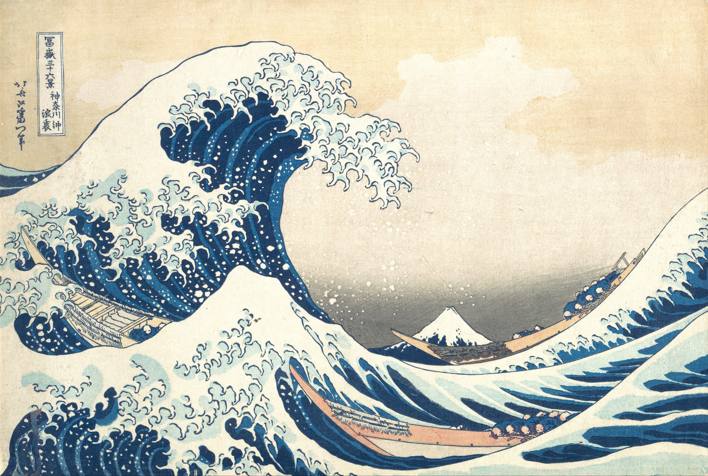

# IDEA9103: Creative Coding Group Project

**University of Sydney** | IDEA9103 Creative Coding
**Team:** Joy (Siying Song), Lihang Shi, Karina Zhu, Adinata Harlan

---

## Inspiration

Our project reinterprets **"The Great Wave off Kanagawa"** (*神奈川沖浪裏*) by **Katsushika Hokusai** (c. 1831), one of the most iconic woodblock prints in the world. The composition captures a towering, claw-like wave at the moment of its peak — frothy white foam breaking into chaos, deep indigo water coiling with tremendous force, and the serene silhouette of Mount Fuji standing small in the background. Its power lies in contrast: explosive motion against absolute stillness, organic chaos against geometric calm.

What drew us to this piece was how much tension exists in a single frozen frame. We asked: what would it look like if this moment were never frozen? The ukiyo-e colour palette — deep Prussian blues layered over cobalt and sky blue, dense ink outlines, flat graphic shapes — gave us a visual language to work with. We wanted to honour that style while making it breathe, pulse, and respond. The four mechanics each answer a different aspect of that question: Perlin noise gives the ocean its organic restlessness; time keeps the scene alive even in silence; audio makes the artwork react to music like a living thing; and user input lets the viewer feel they can disturb the scene, if only for a moment.

---

## Techniques

The project is built in p5.js (non-module, classic multi-file) with p5.sound for audio analysis. All files share a single global scope via `<script>` tags in `index.html`.

**Core p5.js techniques used across the project:**

- **`noise()`** — p5's built-in Perlin noise function, used to generate smooth, organic wave shapes and sun ray flicker. Two-dimensional noise (`noise(x, time)`) produces curves that vary smoothly in both space and time simultaneously.
- **`curveVertex()` inside `beginShape()`** — used for all wave curves and background bands. `curveVertex` generates Catmull-Rom splines through sampled noise points, giving each wave a continuous, flowing silhouette.
- **`push()` / `pop()` with `translate()`, `scale()`, `rotate()`** — all drawing is done in a 1000 × 500 design coordinate system and scaled to fit any window size. The artwork scale and centring offset are recalculated every frame so the composition always fills the screen correctly on resize.
- **`lerp()`, `map()`, `constrain()`** — used throughout for smooth transitions: wave position ranges, audio-to-visual mapping, fade-in and fade-out effects, and colour interpolation.
- **`deltaTime`** — all animation is driven by elapsed seconds (`deltaTime / 1000`) rather than frame count, making motion speed consistent regardless of frame rate.
- **Motion trail history arrays** — each wave records its recent vertical positions. Older states are redrawn each frame at progressively lower opacity, producing a natural motion blur that echoes the wave's path.
- **`p5.FFT` and `p5.Amplitude`** (p5.sound) — used to extract bass, mid, and treble energy from audio in real time, mapping frequency bands to different wave layers and sun behaviour.
- **`sin()` oscillations** — used for boat bobbing, bird rowing arm swings, and sun pulse — any rhythmic, time-driven motion.
- **`bezierPoint()`** — used in `time-mechanic.js` to draw tapered bird wing strokes by sampling a Bézier curve at small intervals and varying `strokeWeight` along the length, simulating the thin-to-thick brush quality of ukiyo-e ink lines.
- **Canvas 2D API blend modes** (`drawingContext.globalCompositeOperation`) — used in `userinput-mechanic.js` to strip the white background from fish SVG images at render time. This is an external technique documented in the External References section below.

---

## Mechanic Ownership

### 🖱️ User Input — Joy (Siying Song)

**What it does:** Gives the viewer two ways to directly disturb the scene.

**Mouse click — fish jumps:** Clicking anywhere in the lower ocean area causes four fish to leap out of the water at random positions. Each fish follows a parabolic arc (`-sin(PI * progress) * jumpHeight`) with a slight stagger in timing. The fish face random directions and each jump is unique.

**Spacebar — wave surge:** Pressing spacebar triggers a smooth boost to the wave amplitude via a lerp-based decay system. The boost makes the waves shorter, and then decays over ~2 seconds, like a wave that peaks and subsides.

**Techniques:** Parabolic arc motion using `sin(PI * progress)`, lerp-based smooth decay for wave boost, coordinate system conversion to map screen clicks into the 1000 × 500 design space, Canvas 2D blend modes for SVG fish rendering.

---

### ⏱️ Time-Based Mechanic — Lihang Shi

**What it does:** Keeps the artwork in constant motion without any viewer interaction.

**Two boats** float across the canvas — one small and distant, one large in the foreground — each bobbing and drifting on sinusoidal paths driven by elapsed time. They are layered between wave lines to create depth. Passengers on each boat are drawn as part of the boat and inherit the same boat transform, so they move and rotate with it.

**Clouds and seagulls** animate in the sky using time only. Soft pre-rendered cloud textures drift slowly from left to right, reset after leaving the canvas, and wait briefly before re-entering. A fixed formation of seven distant line-drawn seagulls scrolls from right to left across the sky; their wing motion is driven by a timer and preset phase offsets rather than random, audio, mouse, keyboard, or Perlin noise.

**The sun** pulses in size and radiates three expanding light rings that fade as they grow. When audio is active, `sunGlowMultiplier` (from `audio_mechanic.js`) causes the rings to expand further and glow brighter in sync with the music.

**The background wave** drifts slowly with a motion trail, adding atmospheric depth.

**Techniques:** Sinusoidal (`sin()`) boat bobbing, timer-driven cloud and seagull movement, preset seagull formation data, `bezierPoint()` for tapered wing strokes, `deltaTime`-based frame-rate-independent animation, layered `push()`/`pop()`/`scale()` for coordinate transforms.

---

### 🎵 Audio Mechanic — Karina Zhu

**What it does:** Connects two looping sound tracks to visual elements so the scene responds to music in real time.

**Starting audio:** A toggle button in the top-left corner starts and stops playback. Both tracks play simultaneously — a wave ambient track and a sun ambient track.

**Wave response:** The wave track is analysed each frame using `p5.FFT`. Bass energy controls the overall `waveHeightMultiplier`, making all waves surge taller with low-end sound. Each individual wave layer is additionally modulated by its own frequency band (bass for upper waves, mids for middle, treble for lower), so different parts of the ocean pulse at different rates.

**Sun response:** `p5.Amplitude` measures the sun track's loudness each frame and maps it to `sunGlowMultiplier`, which controls ray length, ray brightness, and the expansion radius of the time-driven sun rings.

**Techniques:** `p5.FFT` frequency analysis, `p5.Amplitude` level detection, `map()` to translate audio energy into visual multipliers, shared global variables (`waveHeightMultiplier`, `sunGlowMultiplier`) as bridges between mechanic files.

---

### 🌊 Perlin Noise & Randomness — Adinata Harlan

**What it does:** Provides the organic, ever-shifting foundation of the ocean.

**Eight foreground wave lines** move independently. Their vertical positions drift within defined `rangeMin`/`rangeMax` bounds using 2D Perlin noise — each wave has its own speed and phase offset so no two ever move in sync. The curve shape of each wave is also noise-driven: every point samples `noise(x * noiseScale, time * speed + timeOffset)`, producing the characteristic rolling silhouette of ocean waves.

**Wave colours** layer deep Prussian blue, cobalt, and sky blue in multiple strokes, building up the ukiyo-e woodblock aesthetic through colour accumulation. The fourth wave layer is rendered as a solid filled band, reinforcing the sense of water mass.

**Motion trails:** Each wave records its recent position history. Older states are redrawn with progressively lower opacity, creating natural motion blur that gives the ocean a sense of continuous flow.

**Sun rays** use Perlin noise to control each individual ray's length and brightness, making the sun flicker and pulse organically.

**Techniques:** 2D `noise()` for wave position and shape, `curveVertex()` for smooth wave curves, history arrays for motion trails with opacity fade, `noiseScale` and `timeOffset` parameters for independent per-wave behaviour.

---

## AI Acknowledgement

**Claude Code** (Anthropic, model: `claude-sonnet-4-6`) was used throughout this project to assist with code generation, debugging, and implementation decisions. Specific uses include:

- Generating the initial wave rendering system using Perlin noise and `curveVertex()`
- Implementing the motion trail history replay for wave animation
- Debugging SVG fish rendering using Canvas 2D blend modes
- Writing the `p5.FFT` audio analysis and frequency-band-to-wave mapping
- Implementing the sun ring expansion tied to `sunGlowMultiplier`
- Writing the boat drawing function with sinusoidal bobbing and layered hull shading
- Implementing the tapered wing stroke technique using `bezierPoint()`
- Resolving merge conflicts between team members' branches

**ChatGPT / Codex** (OpenAI) was also used during later development to review the multi-file project structure, explain how mechanic files connect through `sketch.js`, refine the time-based cloud and seagull prompts, debug the spacebar wave interaction, and align this README with the current implementation. In particular, it helped identify that the user-input wave boost must affect the same `waveHeightMultiplier` read by `perlin-mechanic.js`, and it helped rewrite the documentation so the time-based bird system is described as a timer-driven fixed formation rather than a Perlin-noise-driven flock.

All AI-assisted code sections are marked with `// AI-assisted` comments in the respective source files. The generated code was reviewed, tested, and modified by each team member to match their mechanic's requirements.

---

## External References

**1. Canvas 2D API — `globalCompositeOperation` blend modes**
Used in `userinput-mechanic.js` to remove the white background from fish SVG images at render time. Setting `drawingContext.globalCompositeOperation = 'multiply'` multiplies each pixel's colour with the canvas beneath it: white (255, 255, 255) multiplied by any colour equals that colour, effectively making white transparent. This is a Canvas 2D API property accessed via p5's `drawingContext` — it is not part of the standard p5.js drawing API.

> Source: MDN Web Docs — *CanvasRenderingContext2D: globalCompositeOperation property*
> https://developer.mozilla.org/en-US/docs/Web/API/CanvasRenderingContext2D/globalCompositeOperation

**2. Tapered stroke technique using `bezierPoint()`**
Used in `time-mechanic.js` to draw bird wing strokes that vary in thickness from thin at the tips to thicker in the middle, mimicking ukiyo-e brush quality. The technique samples a Bézier curve at small intervals using `bezierPoint()`, then draws each segment as a separate `line()` with a `strokeWeight` modulated by `sin(PI * t)` — thin at t=0 and t=1, thick at t=0.5.

> Source: p5.js reference — `bezierPoint()`
> https://p5js.org/reference/p5/bezierPoint/

---

## Interaction Instructions

1. **Open the sketch** in a browser — the animation starts immediately and runs continuously without any input required.

2. **Resize the window** — the artwork scales automatically to fill the browser window at any size, maintaining its 2:1 aspect ratio and keeping all elements in proportion.

3. **Start the audio** — click the music button in the **top-left corner** of the canvas to start two ambient tracks. Click it again to stop. The audio makes the waves surge taller in time with the music and the sun's rays glow brighter with the beat. *Note: browsers require a user interaction before playing audio — the button must be clicked before any sound plays.*

4. **Summon fish** — click anywhere in the **lower ocean area** of the canvas (roughly the bottom half of the artwork). Four fish will leap out of the water at random positions and fall back in. Each click produces a different result.

5. **Surge the waves** — press the **spacebar** to trigger an immediate wave surge. The waves grow taller and then gradually return to normal over roughly 2 seconds.
