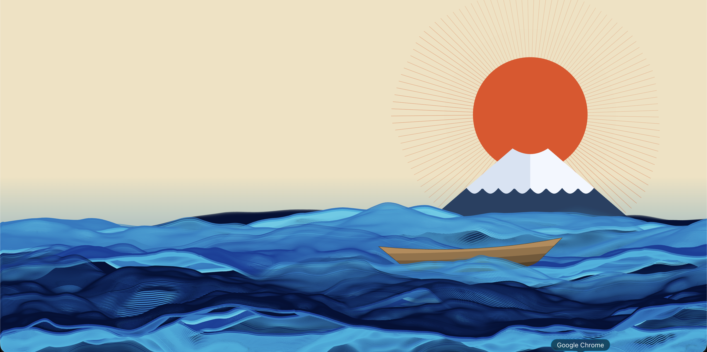

# IDEA9103: Creative Coding Group Project

**University of Sydney** | IDEA9103 Creative Coding
**Team:** Joy, Lihang, Karina, Adinata

---

## Part 1: Project Direction

### Artwork We Are Reinterpreting

Our project reinterprets **"The Great Wave off Kanagawa"** (*神奈川沖浪裏*) by **Katsushika Hokusai** (c. 1831), one of the most iconic woodblock prints in the world. The composition captures a towering, claw-like wave at the moment of its peak — frothy white foam breaking into chaos, deep indigo water coiling with tremendous force, and the serene silhouette of Mount Fuji standing small in the background. Its power lies in contrast: explosive motion against absolute stillness, organic chaos against geometric calm.

### Vision

We reinterpret *The Great Wave off Kanagawa* by transforming its frozen moment of tension into a living, reactive artwork built in p5.js. Hokusai captured a single frame of the ocean at its most violent — we animate what came before and after that instant. Perlin noise drives the organic swell and roll of water across the canvas, sculpting wave forms that rise and fall like the sea itself; audio amplifies the surge, making the waves and sun pulse with sound; time governs the continuous rhythm of the ocean, keeping boats afloat and the sun alive even in silence; and user input gives the viewer agency to disturb the scene — summoning fish from the deep and surging the waves with a keystroke. Together, these four mechanics transform a still woodblock print into something fluid, musical, cyclical, and responsive — a wave that never quite breaks the same way twice.

---

## Part 2: Individual Mechanics

### 🖱️ User Input (Joy)

The User Input mechanic gives the viewer two ways to directly disturb the scene.

**Mouse click — fish jumps:** Clicking anywhere in the lower ocean area of the canvas (the wave region) causes four fish to leap out of the water at random positions scattered across the ocean. Each fish follows a parabolic arc — rising from the surface and falling back in — with a slight stagger in timing between each one so the jumps feel natural rather than mechanical. The fish face random directions and appear at random horizontal and vertical positions within the ocean, so every click produces a different result.

**Spacebar — wave surge:** Pressing the spacebar triggers an immediate boost to the wave amplitude, making all eight foreground wave lines surge visibly taller. The boost then decays smoothly back to its resting state over roughly two seconds, like a wave that peaks and subsides. This gives the viewer a sense of physical force over the ocean.

---

### ⏱️ Time-Based Mechanic (Lihang)

The Time-Based mechanic keeps the artwork in constant motion without requiring any interaction from the viewer.

**Two boats** float across the canvas, one small and distant in the background, one large in the foreground. Each bobs up and down and drifts slightly left and right following smooth sinusoidal paths driven by elapsed time. They are layered between different wave lines — the smaller boat sits behind all the foreground waves, while the larger boat weaves between the third and fourth wave layers, giving the scene genuine depth.

**The sun** pulses gently in size over time and radiates three expanding light rings that fade as they grow outward, creating a continuous breathing effect that makes the sky feel alive.

**The background wave band** drifts slowly up and down between a narrow range, leaving a faint motion trail that adds subtle atmospheric depth behind the foreground waves.

All of this runs continuously from the moment the page loads, requiring no interaction.

---

### 🎵 Audio Mechanic (Karina)

The Audio mechanic connects two looping sound tracks to the visual elements of the artwork, so the scene responds to music in real time.

**Starting audio:** A music button in the top-left corner of the canvas toggles playback — click once to start, click again to stop.

**Wave response:** Two audio tracks play simultaneously — a wave ambient track and a sun ambient track. The wave track is analysed each frame using an FFT (frequency analyser). Bass frequencies control the overall wave height multiplier, making all waves surge taller when low-end energy is high. Each individual wave layer is additionally modulated by its own frequency band — upper waves react to bass, middle waves to mid frequencies, and lower waves to treble — so different parts of the ocean pulse at different rates depending on what the music is doing.

**Sun response:** The amplitude of the sun track directly controls how bright and how far the sun's rays extend, so the sun glows and dims in sync with the music's loudness.

---

### 🌊 Perlin Noise & Randomness (Adinata)

The Perlin Noise mechanic is the foundation of the ocean's organic, ever-shifting appearance.

**Eight foreground wave lines** each move independently. Their vertical positions drift continuously within defined ranges using Perlin noise — each wave has its own speed and phase offset so no two waves ever move in sync. The curve shape of each wave is also noise-driven: every point along the line samples a 2D noise field based on its horizontal position and the current time, producing the characteristic rolling, undulating silhouette of ocean waves.

**Wave colours** are drawn in layered strokes of deep Prussian blue, cobalt, and sky blue, building up the ukiyo-e woodblock aesthetic through colour accumulation. The fourth wave layer is rendered as a solid filled band beneath its curve line, reinforcing the sense of water mass below the surface.

**Motion trails:** Each wave records its recent history of positions. Older states are redrawn with progressively lower opacity, creating a natural motion blur trail that echoes the wave's recent path — giving the ocean a sense of continuous flow rather than frame-by-frame jumping.

**Sun rays** are drawn with Perlin noise controlling the length and brightness of each individual ray, so the sun flickers and pulses organically rather than being a static burst of uniform lines.

---

## Part 3: How the Mechanics Come Together

Each mechanic operates on a different layer of the artwork and they combine without conflict. Perlin noise defines the fundamental shape and position of every wave — this is the baseline that all other mechanics build on top of. Time keeps the scene continuously alive: boats bob, the sun pulses, and the background shifts even when the viewer does nothing. Audio layers a reactive dimension on top — when music plays, the waves breathe in sync with the beat and the sun glows with the music's warmth. User input adds direct agency: clicking the ocean summons fish from beneath the surface, and pressing the spacebar surges the waves like a sudden swell. Together they create a single coherent scene — Hokusai's frozen wave, now fluid, musical, and alive.
