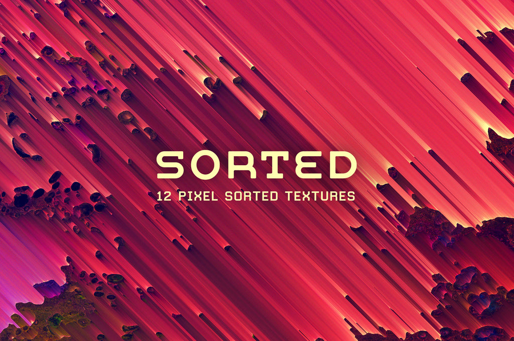
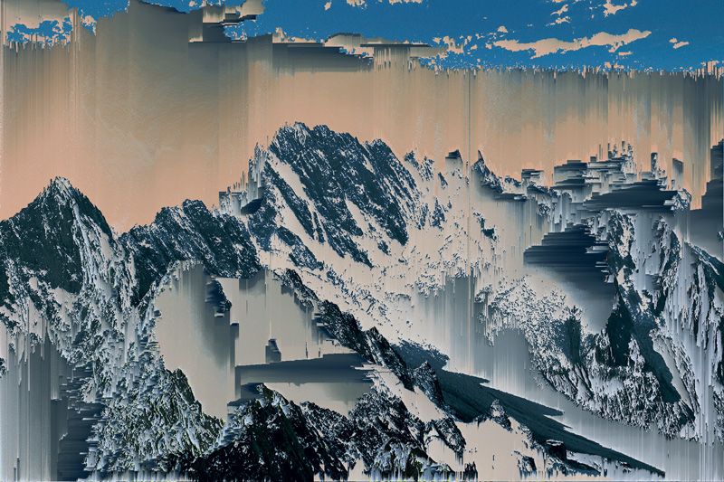

# IDEA9103: Creative Coding Group Project

**University of Sydney** | IDEA9103 Creative Coding
**Team:** Joy, Lihang, Karina, Adinata

---

## Part 1: Project Direction

### Artwork We Are Reinterpreting

Our project reinterprets **"Sorted: 12 Pixel Sorted Textures"** by Mark Walczak and Jim LePage ([Chroma Supply, 2022](https://chromasupply.co)), a series of pixel-sorted digital textures defined by vertical colour streaks, volcanic interruptions, and organic gradients that flow from deep orange through purple into cool blue.

Our second inspiration is **Kim Asendorf's "Mountain Tour"** (2010), the pioneering pixel sorting series that directly influenced Walczak and LePage's work. Asendorf's algorithm, which selects and reorders pixels by brightness along columns, is the foundational technique we build upon.

### Vision

We reinterpret *Sorted* by transforming its static frozen texture into a living, reactive artwork built in p5.js. Inspired by Kim Asendorf's *Mountain Tour*, which pioneered pixel sorting as an artistic method, and Walczak and LePage's application of it to abstract volcanic textures, our version breathes life into the geological depth already latent in the original. Audio drives the intensity of the sorting effect; time governs slow, rhythmic cycles of change; Perlin noise sculpts organic boundaries and colour gradients that drift like magma; and user input gives the viewer direct agency over the experience. Together, these four mechanics transform a still image into something that feels geological, alive, and ever-shifting, like a landscape that never quite repeats itself.

---

## Part 2: Individual Mechanics

### 🖱️ User Input (Joy)

The User Input mechanic serves as the primary controller for the real-time pixel sorting process, turning a static image into a responsive digital environment. The core interaction is mapped to the horizontal movement of the mouse. By moving the mouse along the x-axis, the user adjusts the brightness threshold of the sorting algorithm. Moving the mouse to the left lowers this threshold, allowing more pixels to break free and flow downward in long streaks. Moving it to the right increases the threshold, which stops the movement and stabilizes the image.

Beyond horizontal movement, the vertical y-axis of the mouse controls the length and intensity of these streaks, letting the user stretch the textures into deep, volcanic-like patterns. For further customization, pressing the C key on the keyboard cycles through different color gradients, shifting the visual mood from warm oranges to cool blues. This interactivity directly fulfills our project vision of creating a living artwork. Instead of watching a pre-recorded animation, the viewer actively shapes the geological flow, ensuring that the landscape is constantly shifting and never repeats itself.

---

### ⏱️ Time-Based Mechanic (Lihang)

For the time-based mechanic, I plan to use timers and gradual events to make the artwork feel like it is constantly breathing and transforming, even when the user is not directly interacting with it. The piece will move through slow visual cycles, where the pixel-sorted texture shifts between calm, unstable, and intense states. For example, every few seconds the sorting strength can increase, causing the vertical colour streaks to stretch downward like melting lava or digital rain. After reaching a peak, the distortion will slowly fade back into a quieter state before the next cycle begins.

This mechanic connects to our vision of turning a static pixel-sorted image into a living digital landscape. Time becomes the force that keeps the artwork alive. Instead of the image staying frozen, it gradually changes like geological movement, volcanic heat, or flowing magma. The user does not need to click or drag to experience this mechanic; they can simply watch the artwork evolve over time. This creates a sense of rhythm and anticipation, making the piece feel unstable, organic, and continuously in motion.

---

### 🎵 Audio Mechanic (Karina)

The system analyses the incoming audio and measures its amplitude (overall loudness) and frequency content. These values are combined with the user’s mouse movement to control the pixel-sorting effect. When the user drags the mouse across the screen, the selected area becomes active and begins to respond to the surrounding sound rather than reacting automatically from the start.

When the audio is quiet, the pixels shift gently and remain mostly stable. As the sound becomes louder, the dragged area stretches and displaces horizontally, creating a stronger glitch-like distortion. Low frequencies (bass) move larger groups of pixels, while high frequencies generate finer and more detailed textures. This makes the image pulse and shimmer in sync with both the user’s gestures and the live audio input.

The mechanic connects directly to the project vision by combining human interaction with sound-responsive visuals. The artwork only comes alive after the user touches and drags across the image, turning the static pixel-sorted composition into a dynamic texture shaped collaboratively by movement and audio.

---

### 🌊 Perlin Noise & Randomness (Adinata)

For my mechanic, I plan to use Perlin noise to create a sense of depth and organic movement across the canvas, much like how molten lava flows and breathes naturally. From what I have learned this week, Perlin noise generates smooth, natural-looking random values, which feels perfect for recreating the volcanic and fluid qualities already present in the original *Sorted* artwork by Mark Walczak and Jim LePage.

My idea is to use Perlin noise to control how the colours shift across the canvas and how deep the pixel sorting effect goes in different regions, creating an illusion of layers where some areas feel close and glowing, and others feel dark and deep. Over time, these regions will slowly drift and evolve, making the piece feel like a living, biological liquid rather than a static image.

I will also incorporate a random seed so that the piece can reproduce the same starting state, while still feeling unpredictable as it flows. The user experiences this mechanic by simply watching. The artwork rewards patience, as it never quite repeats itself.

---

## Part 3: How the Mechanics Come Together

Each mechanic operates on a different axis of the artwork. Perlin noise defines the spatial landscape, controlling which regions are bright, deep, or in flux. Audio reshapes that landscape in real time, amplifying the sorting effect wherever sound peaks. Time drives slow background cycles, ensuring the piece never settles even in silence. User input layers personal agency on top, letting the viewer redirect or intensify the whole system. Together they create a single coherent experience: a pixel-sorted texture that is simultaneously geological, musical, cyclical, and responsive.
